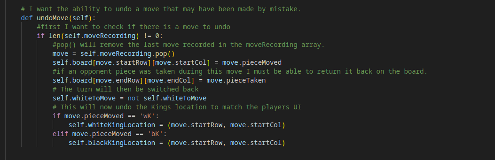
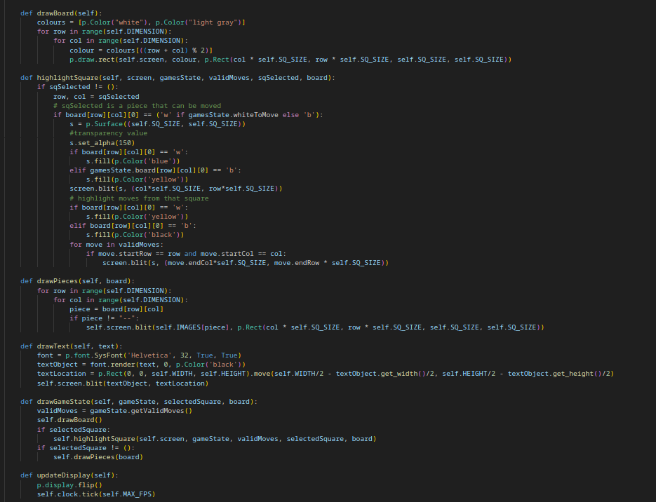
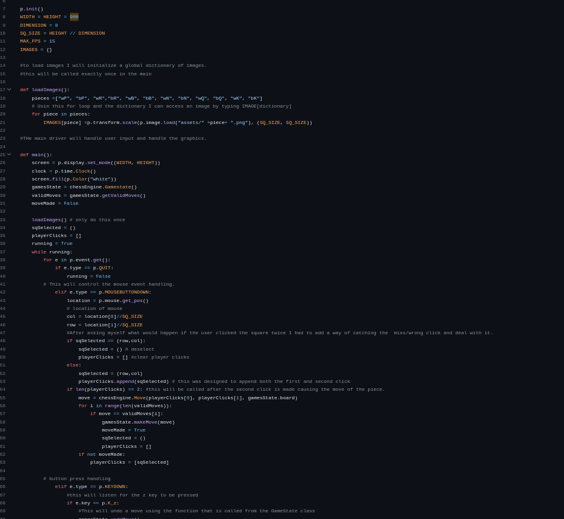
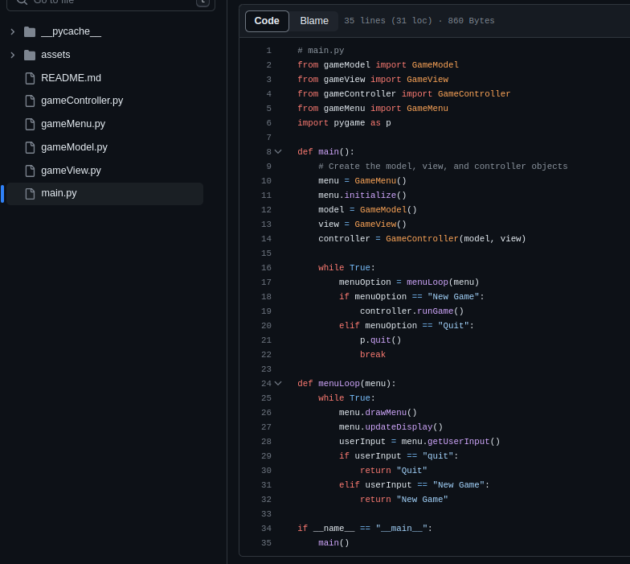
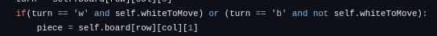
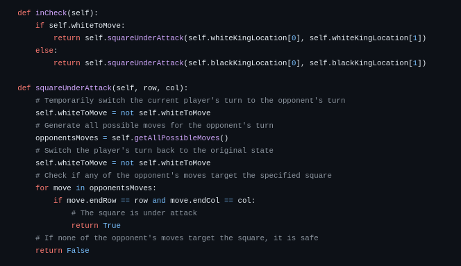
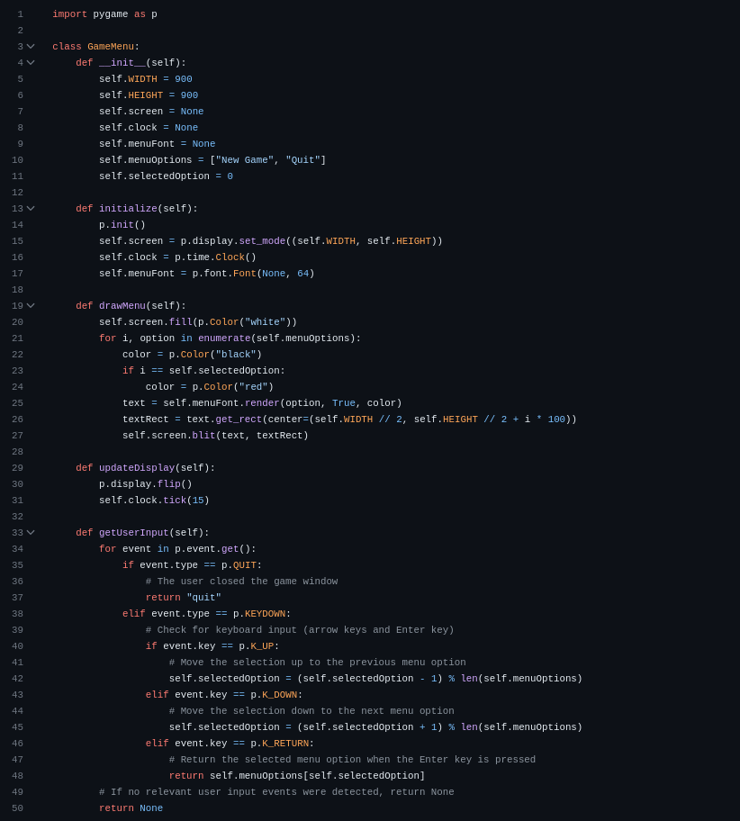
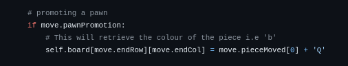

# Ada Chess Project written in Python

# 1. Challenge Outline

### A. Summary and review of the problem.

I am creating a chess game using Python as the programming language. 
I will be building a standard version focusing on creating a simple 
version of Chess that will acknowledge when a player is in checkmate 
or that both players are in a stalemate. I will be trying to incorporate 
as many of the best coding practices. The original release and submitted 
version will involve a menu that allows you to select a new game. 
In future releases, player vs computer functionality will be implemented 
as well as more unique, unknown rules such as the 'En Passant' and 'Castling'. 
I would also be improving the algorithms so that the program may be able to think 
more than one step ahead to show the user the best moves as opposed to all possible 
moves.

### B. UML style diagram illustrating initial overall solution.

### UML : 

### C. Initial working plan, overall approach, development strategy and approach to quality

When I began to design the chess game, I started with a very basic idea of what a 
game should look like and, as can be seen by my commits, I had many trial and errors. 
When deciding on an approach that would better structure the game, I decided to use 
MVC, Model, View and Controller. This better organises the code and makes it easier to 
make changes and updates and helps to create clean code with better organisation. The 
view handles the graphical display such as the highlighted moves as well as 
loading the images of the pieces. The model contains the main methods such as the games 
working out all possible moves, the method that works out if a square is under 
attack and if the potential move is into a valid square. Finally, the Controller contains
the "control logic" it takes the users, choice and then sends it to the model and 
then waits for the response to send back to the view, e.g after a player moves into a 
checkmate position the response from the model will inform the view that the user has 
indeed created a checkmate.
        
My initial plan was to create a file that would take advantage of the libary pygame to 
draw the board and load the images. I decided that I would try and split the chess logic 
and graphics into seperate folders in order to keep them separate and less convoluted than 
a one file project. I was following the Trello I created quite ridgedly at first, however 
due to my lack of focus on design, I began to create two files that became more and more 
convulted due to the lack of a design approach.

I attempted to use an agile approach and wanted to create the game in sprints, however this
started to become unreasonable due to the time constraint and so I created mini sprints in the 
form of user stories. I also tried to work in the 'red', 'green', 'refactor' style (TDD), however 
I amended it to 'code', 'refactor'. This was mainly due to the fact that I was testing the 
game through user testing and 'print()'. As opposed to writing tests that fail, writing the 
logic to make them pass and then refactoring that code. Combining both would have been a 
much better approach and it is definitely something I would consider in future. 
I will disscuss this in more detail below.

### D. Analysis and decomposition of the overall problem into key ‘epic’ style tasks

I used the website Trello to plan the user stories out. I didn't plan an epic story within the 
Trello board as I was working on this as a solo project and overlooked this detail. Reflecting on
this, I would definitely record the epic story to move forward with this project in the months to 
come so that I might remember the exact context in which I was planning out this game i.e
did I want a highly sophisticated chess game or whether it should be more of a simple game. I still 
have tickets in the 'TODO' list as I have more ideas on how to improve the code as well as add more
features to the game and I will explain this further in a later section. I added extra detail when 
needed and as you can tell by the trello board, I still have improvements to make which I 
consider 'Nice to have' but not integral to the finished product to be submitted.

### E. Initial object-oriented design ideas and planned phased breakdown into smaller tasks

One of the main reasons I wanted to incorporate a 'code, refactor' style of coding is to create flexible, 
maintainable and testable code. This is achieveable using the object oriented design and by making use of 
technologies such as Trello I was able to break down user stories into manageable tasks. I made use of many OO principles while designing this game such as Abstraction, Overriding, Encapsulation and creating classes and objects. I will get into more detail later on but these techniques allow me to create good clean code that can be taken on by another with relative ease.

I have created classes where appropriate, such as the Move class which is more important for a specific 
task, i.e to create the moveId which helps track with the movement of each piece, which I reference later. However, I have taken advantage of other techniques than classes i.e the use of the 
dictionary. I chose to create a dictionary as I thought creating a class as a way to avoid an if statement was excessive and so used a dictionary instead. 

When creating functions for the game, I always looked at creating checks to monitor each user input was within the realms of what I wanted them to be able to do. I therefore added checks that made sure they couldn't perform moves such as move 'out of bounds' to interact with pieces on the opposite side as can be seen on line 38 of the 'gameController.py'. I would like to add some try catches into the project and refactor some code to be more defensive, however I felt that this was out of the scope of the project, intial goal and creating a working minimum viable product.

# 2. Development

### A. Adoption and use of ‘good’ standards

When it comes to 'good' standards, I endeavored to make use of the DRY (don't repeat yourself) this can be clearly shown in my getQueenMove method. As the Queen can only move in the direction of a rook or bishop, I was able to use the rook and bishop move methods to create the queen move method which not only saved time but also allowed me to stick to the DRY principle which I felt helped stick to the 'good' coding standards.

I also made sure to indent whilst designing functions to show the scope of where each function was being 
called which would have helped with things like promises if I had needed them. It also allows reviewers to see the beginning and end of control structures. I also tried to avoid deep nesting as much as possible which meant I would only go four steps deep into a nested if/for statement; this allowed me to set a target and helped me create less convoluted code that can be easily read and easily maintanable.

### B. Phase 1 development: tasks, code review and changes

After each ticket I would look to see if the code could be refactored to look more readable. 
As I was using Python, that is known for its readability, I focused on trying to create pure functions 
such as the isValidSquare function as well as the move methods i.e getPawnMove. Pure function allows 
for the code to be easily refactored without impacting on dependant functions and classes. When designing 
any function or class at work, we have many policies we follow and one is to create, as best you can, 
self containing functions that interact with the code base but that could be refactored without affecting 
other things that might impact on live, costing time and money. This project, although non-commercial, should get the same level of professionalism. Rather than creating seperate tickets for the refactoring process, I would then move tickets back to the 'Doing' list when I was refactoring that code. This, although successful, I believe would have been confusing if I was working with other developers and therefore, if I were to do this again, I would have created seperate tickets for each refactor. By refactoring after each ticket I was able to engage in constant code reviews which kept me trying to keep building my app with the original design in the forefront of my mind.
    
An example of my refactoring would be this: 

The original code 'move in validMoves' checks if 'move' is present in a list of 'validMoves'. Even though this code was functional for its purpose it still needed to search the entire list to find the 'move'. With small static lists this may be perfectly fine, however if this list was to get larger for whatever reason it can be time consuming and inefficient, especially if it needs to be performed multiple times.
By creating a loop I was able to reduce some of the complexity and, in the worst situation, it would take the same amount of time to complete. However, by searching the list until it has found the 'move' it is looking for, it will exit the loop and save computing time and is therefore the more efficient way of coding.

### C. Ensuring quality through testing and resolving bugs.

I firstly took advantage of the print machanic in Python which allowed me to check if I was getting the desired results and whether the variables I was creating were being properly passed and handled. e.g: 

The example above shows a small example of this process. I wanted to create a proper notaion so that 
I could clearly see the move of the piece. This was important and I wanted to make sure the movement 
represented on screen matched the computations behind the screen. I created a notation so that each move 
would show the proper move from the square location moved from to the square location the piece moves to. 
I changed the order of the board to start from 1 and not the ordinal number of 0. 
By using print I was able to see this change not only work but provide data that my visuals were not only 
working but were matching the desired computaional outcome.

When debugging, I was able to set breakpoints at specific lines where one might suspect there could be issues. VS Code will run in debugging mode and I was able to select the Python environment option in order to make it more specific to my needs. While debugging, I could inspect the values of variables by hovering the mouse over them, or I could add them to the "Watch" panel to monitor their values throughout the debugging session. I was able to step over or into various code which allowed me to inspect suspected bugs one line at a time. If you reach a point where you believe the code is working correctly, you can continue execution. Using VS Code's debugging tools in this way allowed me to systematically identify and resolve issues within the Chess Game code, ensuring a smoother and error-free gaming experience. This was helpful when assessing if variables were containing the correct information. One of the issues I ran into was during the 'getValidMove' function:

#
Through the use of debugging, I was able to step into the function I was having an issue with and find that, due to a poor design, I had to add duplicate code in the form of the 'whiteToMove' variable/flag. Due to the extra functionality, such as checking if the move created a check, checkmate or stalemate, I had to make sure that after a move was made it remained the user's turn until the function could check if it matched any of the aforementioned game states. I had to make sure that each time there was a natural changing of turns, i.e after the 'makeMove' function, I switched the turns back for a final check on the state of play.

# 3. Evaluation

### A1 . Code Refactoring

In my MVC Chess project, I applied effective code refactoring techniques to improve the overall code design, readability, and maintainability. One key example of code refactoring was the use of a dictionary 
(self.moveFunctions) to map each piece type to its corresponding move function. This approach made the 
getValidMoves() method more concise and easier to manage, as it centralised the piece-specific move logic 
in separate methods. Another successful refactoring was the use of dictionary comprehensions to create rowsToRanks and colsToFiles, which efficiently mapped rank and file values between the board representation and chess notation. These refactoring strategies greatly enhanced the clarity and modularity of my code.

### A2 .Code Reuse

Throughout the MVC Chess project, I endevoured to reuse code, helping to minimise redundancy and improve efficiency. For instance, I implemented methods like getRookMoves() and getBishopMoves() to calculate legal moves for both the rook and bishop pieces.Reusing these methods in the getQueenMoves() showcased effective code reuse by using the functionalities of both rook and bishop moves. 

Additionally, the makeMove() and undoMove() methods were designed to be universally applicable for any chess piece, further enhancing code reuse. By reusing these functions, my code became more streamlined and maintainable, contributing to the overall robustness of the project.

### A3 . Code Smells

As a developer working on the MVC Chess project, I find code quality and maintainability crucial for 
the success of the application. To ensure this success, I rely on various tools, with Pylint being a 
key asset in my arsenal. Pylint, a powerful static code analysis tool, helps me identify potential code 
smells, enforce adherence to the PEP 8 style guide, and maintain consistency throughout the project.
By incorporating Pylint and following its recommendations in the MVC Chess project, I can confidently 
identify and address potential code smells, ensuring that the codebase remains clean, maintainable, and 
adheres to the good codeing practices I mentioned earlier.

### B. Advanced programming principles

One of the programming principles I used quite frequently is encapsulation. The 'GameController' 
class encapsulates the game logic and control flow. It abstracts the interactions between the 
model and view, allowing them to communicate through its methods:

When it comes to abstraction the GameModel class exhibits abstraction by providing separate methods 
for each piece's movement logic, abstracting away the complexities. Abstraction involves hiding 
implementation details and presenting only relevant information to the user which is demonstrated
here:

I have the Move class representing a chess move. The 'GameModel' class has different 
methods such as getBishopMoves, getRookMoves, 'getQueenMoves', and 'getKingMoves', each handling moves specific to a particular piece. However, when generating all possible valid moves, I use the 'getAllPossibleMoves' method, which, thanks to polymorphism, uniformly invokes the relevant move methods based on the piece being considered:

### Features showcase and embedded innovations

In my chess game code project, I have implemented several key features and innovative functionalities 
to create an engaging and user-friendly experience. One notable feature is the Model,View and Controller, 
which creates a separation of concerns and enhances code organization. This design pattern allows me to easily manage the game's logic (Model), user interface (View), and user input handling (Controller). 

Furthermore, I have utilized object-oriented programming (OOP) to encapsulate data and behaviour 
within classes, as mentioned earlier. This OOP approach promotes code reusability and extensibility. 
An excellent example of this is the use of polymorphism to calculate valid moves for each piece type. 
The 'getAllPossibleMoves' method dynamically dispatches the move calculation to the specific piece's 
move function.

Another standout feature is the implementation of an undo functionality. Players can undo their 
moves by invoking the undoMove method in the GameModel class. This innovation leverages a stack-like 
mechanism, allowing players to revert their last move and provides a safeguard against accidental mistakes. The undo feature enhances user experience and showcases the power of Python's list operations to manage move history efficiently.

Additionally, I have incorporated a graphical user interface using the Pygame library. 
The GameView class renders the chessboard and pieces on the screen, creating an intuitive and 
visually appealing interface. Players can interact with the board through mouse clicks, and 
highlighted squares display valid moves when selecting a piece. This GUI enriches the gaming
experience and provides players with a user-friendly platform to enjoy the game.

These features collectively highlight the best aspects of my code, ensuring a comprehensive and 
enjoyable chess game.

### Improved algorithms – research, design, implementation, and tested confirmation.

When designing the game I spent very little time on the structure and more on getting a working app. 
This became a big issue as my code was, although functional, was challenging to manage and maintain.
When I finally refactored the code to the MVC architecture, the Gamestate class now serves as the Model, 
responsible for storing the current state of the chess game and determining valid moves. The index.py 
file handles the View and Controller aspects, taking care of user input, graphical display, and 
coordinating with the Gamestate model.

Before MVC:

And Now:

Through my research, I found dictionaries and, as I have shown throughout this read me, I make use of one to avoid very long if statements. This dictionary make my code more readable and easier to manage.

My initial idea:

if (turn == "w" and self.whiteToMove) or (turn == "b" and not self.whiteToMove):
                    piece = self.board[row][col][1]
                    if piece == "P":
                        self.getPawnMoves(row, col, moves)
                    elif piece == "R":
                        self.getRookMoves(row, col, moves)
                    elif piece == "N":
                        self.getKnightMoves(row, col, moves)
                    elif piece == "B":
                        self.getBishopMoves(row, col, moves)
                    elif piece == "Q":
                        self.getQueenMoves(row, col, moves)
                    elif piece == "K":
                        self.getKingMoves(row, col, moves)

This, although functionable would have took up unnecessary space and if I was to continue in this mindset I may have created something unreadable and unmanageable. However, after finding the dictionary feature
I decided to use that instead. 

Dictionary:

### Reflective review, opportunities to improve and continued professional development.

On reflection, one strength of my code lies in its efficient use of dictionaries to represent the chess pieces and their movements. By mapping each piece to its corresponding move function, the code becomes concise and readable (an example of this can be seen above). Additionally, the code demonstrates good use of conditional statements and loops to handle valid moves and game rules. For instance, the 'getValidMoves' method effectively generates all possible moves and filters out illegal moves by considering the opponent's moves and potential checks on the king.

As demonstrated here:

The code also features a simple yet functional graphical user interface using the Pygame library. 
The 'GameView' class effectively loads chess piece images, draws the chessboard, highlights squares, and 
updates the display. The implementation of the menu system (GameMenu) further enhances the user experience, allowing users to start a new game or quit the application.

When it comes to improvements, I feel although my documentation is helpful, it is still lacking and the code could benefit from enhanced code documentation to help with its readability for both current developers and any future developers should there be any.

I would also look to incorporate type hints into my project, as can be seen in the Python documentation 
https://docs.python.org/3/library/typing.html. Type hints would provide more clarity on function arguments and return types, assisting in code maintenance and reducing the chances of bugs caused by type-related issues.

For professional development, I would consider refactoring the codebase to conform to a more consistent coding style, following popular Python style guides like PEP 8, examples can be found here: 
https://peps.python.org/pep-0008/. At work, we follow the psr-12 (https://www.php-fig.org/psr/psr-12/) guidelines as well as others, such as doctrine (https://github.com/doctrine/coding-standard). Using these coding standards not only do we manage to keep every member of the company coding in the same way, but it makes it easier to share tasks if everyone is designing in a similar way. This makes refactoring and reading of code easier than if we allowed each developer to write using their own coding standards. 

To challenge myself further, I could explore additional chess features, such as castling and en passant. I would look at my current pawn promotion structure and make it possible for the user to pick which piece they would like to promote their pawn to as opposed to defaulting them to the most efficient choice. 

Additionally, I would seek opportunities to optimize the code for better performance. Profiling the 
code and identifying bottlenecks would allow me to make targeted optimizations, resulting in a more 
responsive and efficient chess engine.

I would then look to add an AI component to my game which would allow me to create a PvE version of my game. This would require further tuning of my 'allPossibleMoves' function to allow the AI to think multiple steps ahead instead of the one my current computations allow. I would like to incorporate websockets into the project to allow for multiplayer across different machines.

Given more time, this could also be refactored to support 4D chess allowing for myself or another coder to experiment more with the current borders of the chess board. At the moment I have the game monitoring and blocking pieces from moving beyond those borders.

Using the OOP's as well as the MVC architecture, I have created a great platform from which to take this
project to the next level and with the separation of concerns I have attempted to create, I believe that 
improvements of a small nature or a bigger overhaul refactor would be easy to achieve.
