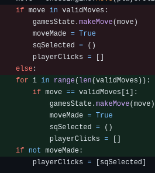

# Ada Chess Project written in Python

# 1. Challenge Outline

### A. Summary and review of the proplem.

I am creating a Chess Game using Python as the programming language, 
I will be building a stardard version focusing on creating a simple 
version of Chess that will acknowledge when a player is in checkmate 
or that both players are in a stalemate. I will be trying to incorperate 
as many of the best coding practices. The original release and submitted 
version will involve a menu that allows you to select a new game. 
In future releases, player vs computer functionality will be implemented 
as well as more unique, unkniwn rules such as the 'En Passant' and 'Casteling'. 
I would also be improving the algoryths so the program may be able to think more 
than one step ahead to show the user the best moves as opposed to all possible moves.

### B.  UML style diagram illustrating initial overall solution.

### UML : 

### C. Initial working plan, overall approach, development strategy and approach to quality

    When I began to design the Chess Game I started with a very basic idea of what a 
    game should look like and as can be seen by my commits I had many trial and errors. 
    when decideing or an approach that would better structure the game I decided to use 
    MVC, Model, View and Controller. This better organises the code and make it easier to 
    make changes and updates and helps to create clean code with better organisation. The 
    view handle the the graphical display such as the the highlighted moves as well as 
    loading the images of the pieces. The model contains the the main methods such as the 
    the games working out all possible moves, the method that works out if a square is under 
    attack and if the potential move is into a valid square. Finally the Controller contains
    the the "control logic" it takes the users choice and then sends it to the model and 
    then waits for the response to send back to the view e.g after a player moves into a 
    checkmate position the response from the model will inform the view that the user has 
    indeed created a checkmate.
        
    My initial plan was to create a file that would take advantage of the libary pygame to 
    draw the board and load the images. I decided that I would try and split the chess logic 
    and graphics in seperate folders as to keep them seperate and less conviluted than a one 
    file project. I was following the kamban board I created quite ridgedly at first however 
    due to my lack of focus on design I began to create two files that became more and more 
    convulted due to the lack of a design approach.

    I attempted to use an agile approach and wanted to create the game in sprints, this however 
    started to become unreasonable due to the time constraint and so created mini sprints in the 
    form of user stories. I also tries to work in the 'red', 'green', 'refactor' style however 
    I amended it to 'code', 'refactor'. This was mainly due to the fact that I was testing the 
    game through user testing and print(). as opposed to writting tests that fail, writting the 
    logic to make them pass and then refactoring that code. Combining both would have been a 
    much better approach and it is deffinantly something I would consider in future., 
    I will disscuss this in more detail below.

### D. Analysis and decomposition of the overall problem into key ‘epic’ style tasks

    I used the website Trello to plan the user stories out. I didn't plan an epic story within the 
    Trello board as I was working on this as a solo project and overlooked this detail. Reflecting on
    this I would deffinatly wirte the epic story down as if I were to move forward with this project 
    in the months to come I might remember the exact context in which I was planning out this game i.e
    did I want a highly sophisticated chess game or whether it should be more of a simple game. I still 
    have tickets in the 'TODO' list as I have more ideas on how to improve the code as well as add more
    features to the game and I will explain this furthur in a later section. I added extra detail when needed
    and as you can tell by the trello board, as referenced earlier, I still have improvements to make which I 
    consider 'Nice to have' but not integeral to the finished product to be submitted.

### E. Initial object-oriented design ideas and planned phased breakdown into smaller tasks

    One of the main reasons I wanted to incorperate a 'code, refactor' style of coding is to create flexible , 
    maintainable and testable code. This is achieveable using the object oriented design and by making use of 
    technologies such as Trello I was able to break down user stories into manageable tasks. I made use of many 
    OO princeples while designing this game such as Abstraction, Overriding, Encapsulation and creating classes 
    and object I will get into more detail later on but these techniques alow me to create good clean code that 
    can be taken on by another with relative ease.

    I have crteated classes where appropriate such as the Move class which is more important for a specific 
    task i.e to create the moveId which helps track with the movement of each piece, which I will go into 
    more detail later on. However, I have taken advantage of other techniques than classes i.e the use of the 
    dictionarty I chose to create a dictionary as I thought creating a class as a way to avoid an if statement was 
    'overkill' and so used a dictionary instaed. 

    When creating functions for the game I always looked at creating checks to monitor each user input was within 
    the realms of what I wanted them to be able to do. I therefore added checks that made sure they couldn't do moves 
    such as move 'out of bounds' to interact with pieces on the opposite side as can be seen on line 38 of the 
    gameController.py. I would like to add some try catches into the project and write refactor some code to be more 
    defensive however I felt that this was out of the scope of the project and intial goal and creating a working minimum 
    viable product.

# 2. Development

### A. Adoption and use of ‘good’ standards

    When it comes to 'good' standards I endevored to make use of the DRY (don't repeat yourself) this can be 
    clearly shown in my getQueenMove method. AS the Queen can only move in the direction of a rook or bishop 
    I was able to use the rook and bishop move methods to create the queen move method which not only saved 
    time but also allowed me to stick to the DRY principle which I felt helped stick to the 'good' coding standards. 

    I also made sure to indent whilst designing functions to show the scope of where each function was being 
    called which would have helped with things like promises if I had needed them. It also allows reviewers to see 
    the beginning and end of control structures. I also tried to avoid deep nesting as much as possible which meant
    I would only go a max of a nested if/for of 4 this, although not great allowed me to set a target and helped me
    create less convaluted code that can be easily read and easily maintanable.

### B. Phase 1 development: tasks, code review and changes

    After each ticket I would look to see if if the code could be refactored to look more readable. 
    As I was using Python, that is known for its readability I focused on trying to crate pure functions 
    such as the isValidSquare function as well as the move methods i.e getPawnMove. Pure function allow 
    for the code to be easily refactored without impacting on dependant functions/classes. When designing 
    any function or class at work we have many policies we follow and one is to create, as best you can, 
    self containing functions that interact with the code base but that could be refactored without effecting 
    other things that might impact on live costing time and money. This project although non-comercial should 
    get the same level of professionalism. Rather than creating seperate tickets for the refactoring process 
    I would then move tickets back to the doing list when I was refactoring that code. This, although
    successful I believe would have been confusing if I was working with other developers and therfore if I  
    were to do this again I would have created seperate tickets for each refactor. By refactoring after each ticket
    I was able to to engage in constant code reviews which kept me trying to keep building my app with the original 
    design in the forefront of my mind.
    
    An example of my refactoring would be this: 

    The original code 'move in validMoves' checks if 'move' is present in a list of 'validMoves'. Even though this
    code was functional for its purpose it still needed to search the entire list to find the 'move'. With small 
    static lists this may be perfectly fine however if this list was to get larger for whatever reason it can be 
    time consuming and inefficient especially if it needs to be performed multiple times.
    By creating a loop I was able to reduce some of the complexity, in the worst situation it would take the same 
    amount of time to complete. However by searching the list until it has found the 'move' it is looking for it will 
    exit the loop and save computing time therefore the more efficient way of coding.

### C. Ensuring quality through testing and resolving bugs.

    I firstly took advantage or the print machanic in python which allowed me to check if I was getting the disiered 
    results and whether the variables I was creating, was being properly passed and handled. e.g: 

    The example above shows a small example of this process. I wanted to create a proper notaion so that 
    I could clearly see the move of the piece. this was important and I wanted to make sure the movement 
    reresented on screen matched the computations behind the screen. I created a notation so each move 
    would show the proper move from the square location moved from to the square location the piece moves to. 
    Changed the oreder of the board to start from 1 and not the ordinal number of 0. 
    using print I was able to see this change not only work but provide data that my visuals were not only 
    working but were matching the desiered computaional outcome.

    For the debugging I was able to set breakpoints at specific lines where you suspect there might be issues. VS Code 
    will run in debugging mode and I was able to select the python environment option as to make it more specific to my 
    needs. While debugging, I could inspect the values of variables by hovering the mouse over them, 
    or I could add them to the "Watch" panel to monitor their values throughout the debugging session. I was able 
    to step over or into various code which allowed me to inspect suspected bugs one line at a time. If you reach 
    a point where you believe the code is working correctly, you can continue execution. Using VS Code's debugging 
    tools in this way allowed me to systematically identify and resolve issues within the Chess Game code, ensuring 
    a smoother and error-free gaming experience. This was helpful when assesing if variables where containing the correct information. 
    One of the issues I ran into was during the 'getValidMove' function:

#
    Through the use of debugging is was able to step into the function I was having an isse with and find that due to 
    a poor design I had to add duplicate code in the form of the 'whiteToMove' variable/flag. due to the extra functionality
    such as checking if the moke created a check, checkmate or stalemate I had to make sure that after a move was made it 
    remained the users turn until the function could check if it matched any of the aforementioned game states. I had to 
    make sure that each time there was a natural changing of turns i.e after the 'makeMove' function I switched the turns
    back for a final check on the state of play.

# 3. Evaluation

### A . Code Refactoring

    In my MVC Chess project, I applied effective code refactoring techniques to improve the overall code design, 
    readability, and maintainability. One key example of code refactoring was the use of a dictionary 
    (self.moveFunctions) to map each piece type to its corresponding move function. This approach made the 
    getValidMoves() method more concise and easier to manage, as it centralised the piece-specific move logic 
    in separate methods. 
    Another successful refactoring was the use of dictionary comprehensions to create rowsToRanks and colsToFiles, 
    which efficiently mapped rank and file values between the board representation and chess notation. 
    These refactoring strategies greatly enhanced the clarity and modularity of my code.

### A .Code Reuse

    Throughout the MVC Chess project, I endevoured to reuse code helping minimise redundancy and improve efficiency. 
    For instance, I implemented methods like getRookMoves() and getBishopMoves() to calculate legal moves for 
    both the rook and bishop pieces. 
    Reusing these methods in the getQueenMoves() showcased effective code reuse by using the functionalities 
    of both rook and bishop moves. 

    Additionally, the makeMove() and undoMove() methods were designed to be universally applicable for any chess piece, 
    further enhancing code reuse. By reusing these functions, my code became more streamlined and maintainable, 
    contributing to the overall robustness of the project.

### A . Code Smells

    As a developer working on the MVC Chess project, I find code quality and maintainability crucial for 
    the success of the application. To ensure these aspects, I rely on various tools, with Pylint being a 
    key asset in my arsenal. Pylint, a powerful static code analysis tool, helps me identify potential code 
    smells, enforce adherence to the PEP 8 style guide, and maintain consistency throughout the project.
    By incorporating Pylint and following its recommendations in the MVC Chess project, I can confidently 
    identify and address potential code smells, ensuring that the codebase remains clean, maintainable, and 
    adheres to the good codeing practices I mentioned earlier.

### B. Advanced programming principles

    One of the programmin principles I used quite frequently is encapsulation, The 'GameController' 
    class encapsulates the game logic and control flow. It abstracts the interactions between the 
    model and view, allowing them to communicate through its methods:

    When it comes to abstraction the GameModel class exhibits abstraction by providing separate methods 
    for each piece's movement logic, abstracting away the complexities. Abstraction involves hiding 
    implementation details and presenting only relevant information to the user which is demonstarted
    here:

    I have the Move class representing a chess move. The 'GameModel' class has different 
    methods like getBishopMoves, getRookMoves, 'getQueenMoves', and 'getKingMoves', each handling moves specific 
    to a particular piece. However, when generating all possible valid moves, I use the 'getAllPossibleMoves' 
    method, which, thanks to polymorphism, uniformly invokes the relevant move methods based on the piece being 
    considered:

### Featuresshowcase and embedded innovations

